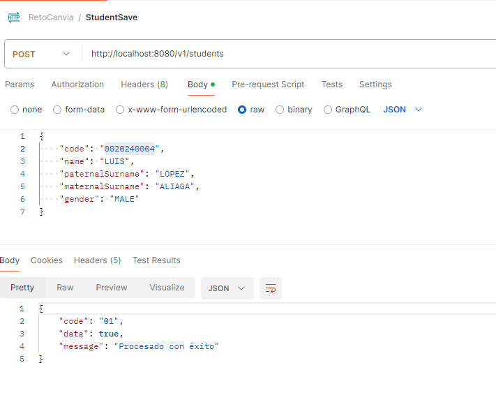
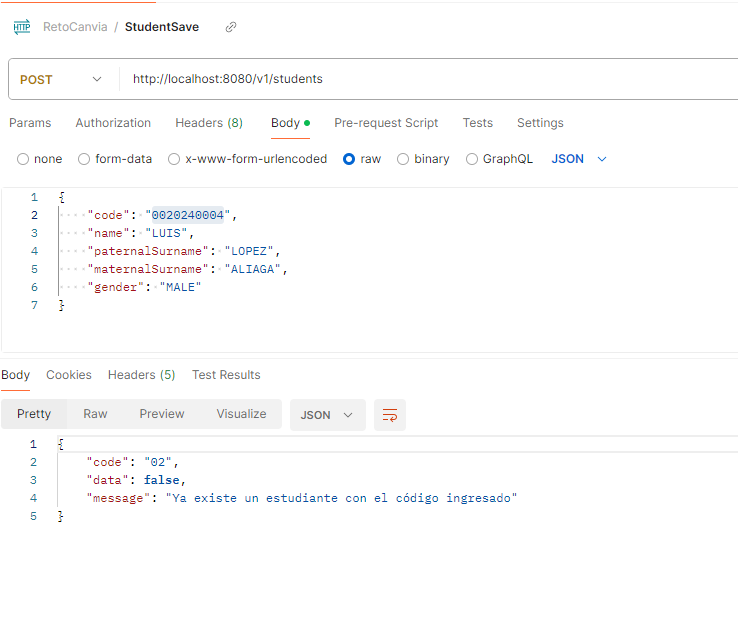
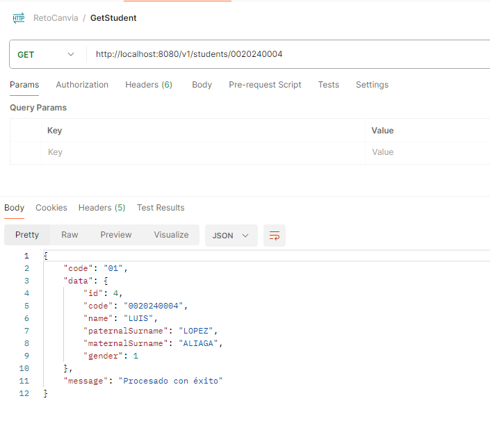
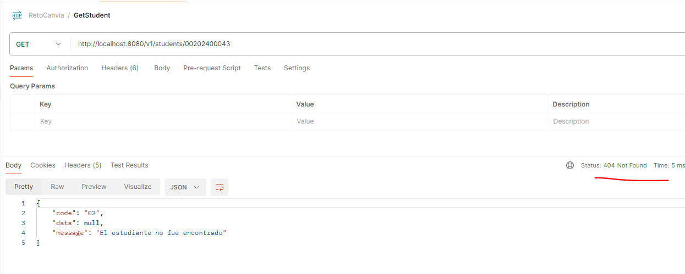
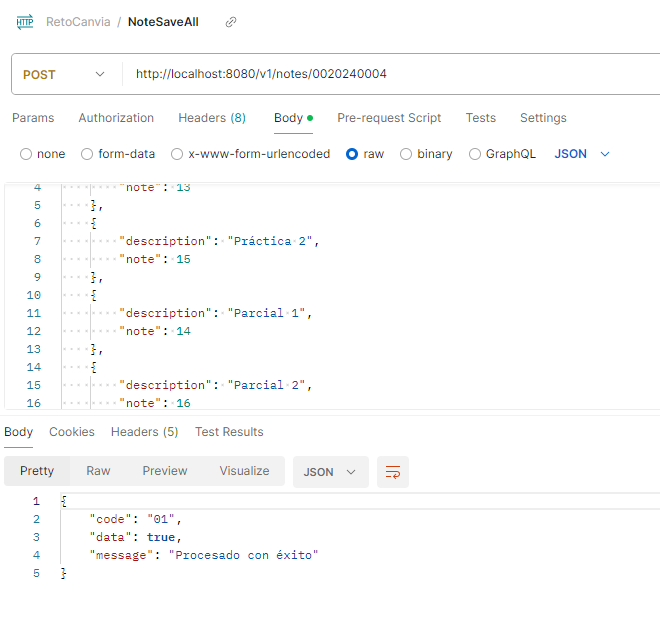
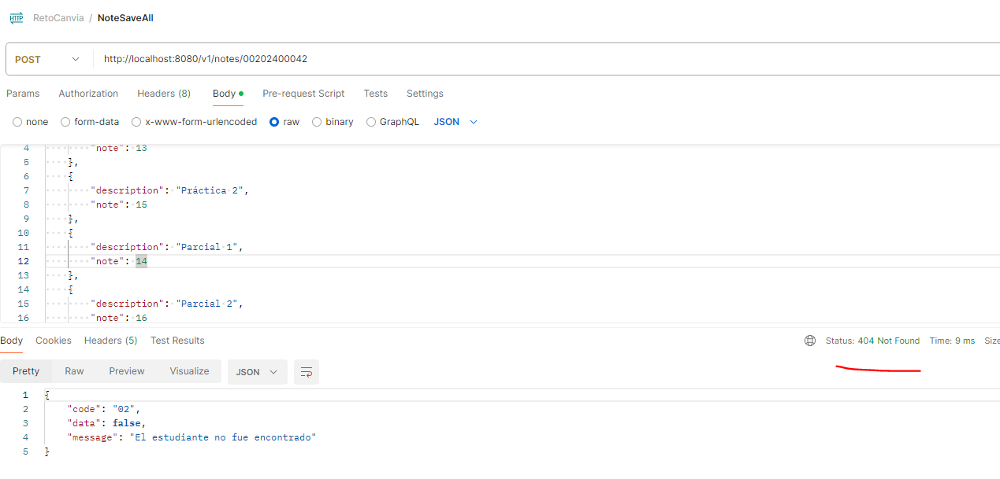
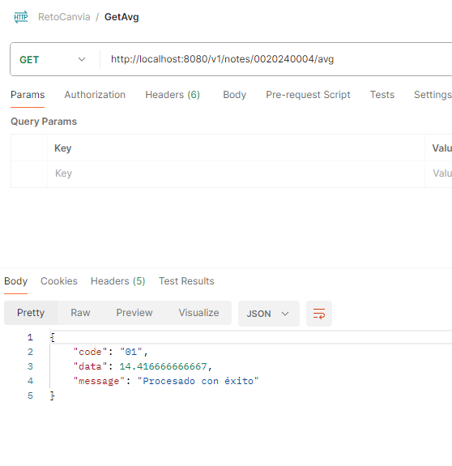
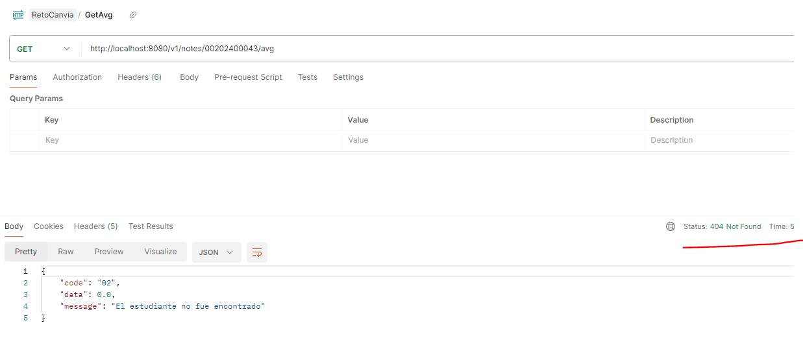

# Reto Canvia

## La conexión a base de datos
spring.datasource.url=jdbc:h2:file:/data/canvia

spring.datasource.username=sa

spring.datasource.password=password

Url para acceder:

http://localhost:8080/h2-console

## Postman
Postman con los endpoints creados: [RetoC☺anvia.postman_collection](RetoCanvia.postman_collection.json)

Capturas de ejemplo:

Registrar Estudiante con éxito

Registrar Estudiante con el mísmo código

Obtener Estudiante con éxito

Obtener Estudiante con código que no existe

Registrar Notas con éxito

Registrar Notas con código de estudiante que no existe

Obtener Promedio con éxito

Obtener Promedio con código de estudiante que no existe

